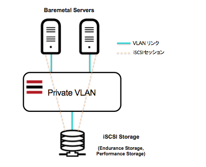

iscsiStorage01 Cookbook
=======================
 このクックブックは、これらのiSCSIストレージの認証ファイルの作成、マルチパス設定、fstab設定、マウントまでを実行します。
ソフトレイヤーのiSCSIストレージとして、パフォーマンス・ストレージ、エンデュランス・ストレージが提供されており、このクックブックは、これらのストレージの接続設定を自働化します。


システム構成
------------
複数のベアメタルサーバーや仮想サーバーから、iSCSIストレージへのセッションを確立します。属性(Attributes)の["iscsi_host"]が、"master"であれば、ファイルシステムを作成してマウントまでを実行します。一方、"stanby"であれば、セッションの確立するまでに留めます。




要件(Requirements)
------------

#### CHEFのバージョン
- Chef 12.5 以上 (これより前のバージョンで確認していません。)

#### 対応オペレーティングシステム
- CentOS 7.x - Minimal Install (64 bit) 
- CentOS 6.x - Minimal Install (64 bit) 
- Debian GNU/Linux 8.x jessie/Stable - Minimal Install (64 bit) 
- Ubuntu Linux 14.04 LTS Trusty Tahr - Minimal Install (64 bit) 

#### 対応ストレージ
- Endurance Block Storage
- Performance Block Storage

このクックブックの適用前までに、ブロック・ストレージがオーダーが完了している必要があります。

#### SoftLayer カスタマーポータルの操作
- ブロック・ストレージがオーダーが完了していること
- 仮想サーバーまたはベアメタルサーバーのオーダーが完了していること
- ブロック・ストレージの Authorized Hosts に対象サーバーが含まれていること

Authorized Hostsのリストへの追加方法は、ソフトレイヤー活用ガイドの次をご参照ねがいます。
- [1.6.6 パフォーマンス・ストレージを利用するには？](https://www.change-makers.jp/post/10318)
- [1.6.7 エンデュランス・ストレージを利用するには？](https://www.change-makers.jp/post/10319)


属性(Attributes)
----------
サーバーインスタンスから、これらのiSCSIブロック・ストレージへアクセスするためには、次の属性が正しく設定されていなければなりません。

#### iscsiStorage01::default
<table>
  <tr>
    <th>Key</th>
    <th>Type</th>
    <th>Description</th>
    <th>備考</th>
  </tr>
  <tr>
    <td>["iscsi_target_ipaddr"]</td>
    <td>String</td>
    <td>iSCSIのターゲットIP</td>
    <td>必須</td>
  </tr>
  <tr>
    <td>["iscsi_user_name"]</td>
    <td>String</td>
    <td>購入時付与されるユーザID</td>
    <td>必須</td>
  </tr>
  <tr>
    <td>["iscsi_user_password"]</td>
    <td>String</td>
    <td>ユーザIDのパスワード</td>
    <td>必須</td>
  </tr>
  <tr>
    <td>["initiator_name"]</td>
    <td>String</td>
    <td>iSCSI の World Wide ID</td>
    <td>必須</td>
  </tr>
  <tr>
    <td>["multipath_device"]["name1"]</td>
    <td>String</td>
    <td>マルチパスのメタデバイス名</td>
    <td>必須 /dev/mapper/**** </td>
  </tr>
  <tr>
    <td>["multipath_device"]["mount1"]</td>
    <td>String</td>
    <td>マウントポイント</td>
    <td>必須 /data1など</td>
  </tr>
  <tr>
    <td>["iscsi_host"]</td>
    <td>String</td>
    <td>択一 master/standby</td>
    <td>選択必須</td>
  </tr>
</table>


利用方法(Usage)
-----
ここでは、すぐに使える最も単純なスタンドアロンでの適用方法を紹介します。
CHEFをインストールして、dummy のクックブックを作ってディレクトリを初期化します。既にCHEFが導入されクックブックの領域が作成されていれば、この操作は必要ありません。

```
# curl -L https://www.opscode.com/chef/install.sh > install.sh
# bash install.sh -v 12.5
# knife cookbook create dummy -o /var/chef/cookbooks
```
クックブックをGitHUBからダウンロードします。

```
# cd /var/chef/cookbooks/
# git clone https://github.com/takara9/iscsiStorage01
```
iSCSIストレージに必要な認証情報等をセットします。ここでは["iscsi_host"]="master"にしておきます。設定を変更した時の動作は後述しますので、説明は省略します。

```
# vi attributes/default.rb
```
クックブックを適用します。この時のディレクトは何処から実行しても構いません。

```
# chef-solo -o iscsiStorage01
< 中略 >
Running handlers complete
Chef Client finished, 17/21 resources updated in 57 seconds
```
これで、iSCSIブロックストレージを利用可能になりました。


## 実行結果
dfコマンドで、/mysql_data1 がマウントされている事が確認できます。

```
# df
ファイルシス         1K-ブロック    使用   使用可 使用% マウント位置
/dev/xvda2              25412940 1634784 22480596    7% /
devtmpfs                  497688       0   497688    0% /dev
tmpfs                     505924       0   505924    0% /dev/shm
tmpfs                     505924    6612   499312    2% /run
tmpfs                     505924       0   505924    0% /sys/fs/cgroup
/dev/xvda1                245679  133939    98633   58% /boot
/dev/mapper/iscsimp1    20511312   45080 19401272    1% /mysql_data1
```
次のコマンドで、マルチパス設定が有効となり、iSCSIターゲットに対して２系路で接続されている事が確認できます。

```
# lsblk
NAME       MAJ:MIN RM  SIZE RO TYPE  MOUNTPOINT
sda          8:0    0   20G  0 disk  
└─iscsimp1 253:0    0   20G  0 mpath /mysql_data1
sdb          8:16   0   20G  0 disk  
└─iscsimp1 253:0    0   20G  0 mpath /mysql_data1
xvda       202:0    0   25G  0 disk  
├─xvda1    202:1    0  256M  0 part  /boot
└─xvda2    202:2    0 24.8G  0 part  /
xvdb       202:16   0    2G  0 disk  
└─xvdb1    202:17   0    2G  0 part  [SWAP]
```

#### バックアップとしての設定方法 (["iscsi_host"]="backup")

SoftLayerのiSCSIストレージは、単一障害点の無い専用ストレージ装置ですから、アクティブ・スタンバイの複数のサーバーと接続して、クラスタを構成できます。　
マスターのiSCSIホストに、バックアップサーバーを追加する際に、attributes/default.rbに次の様に設定します。

```
< 前略 >
default["iscsi_host"] = 'backup'
```

この様に設定することで、未マウント状態のバックアップすなわち待機系としてiSCSIストレージを共有するサーバーを設定できます。

CHEFの設定完了時の状態は、マウントされておらず、マルチパス設定だけが有効な状態になります。

```
< 中略 >
Running handlers complete
Chef Client finished, 15/21 resources updated in 01 minutes 13 seconds
# df
ファイルシス   1K-ブロック    使用   使用可 使用% マウント位置
/dev/xvda2        25412940 1636096 22479284    7% /
devtmpfs            497688       0   497688    0% /dev
tmpfs               505924       0   505924    0% /dev/shm
tmpfs               505924    6612   499312    2% /run
tmpfs               505924       0   505924    0% /sys/fs/cgroup
/dev/xvda1          245679  133942    98630   58% /boot
```
マルチパス設定は有効になっている状態なります。

```
# lsblk
NAME       MAJ:MIN RM  SIZE RO TYPE  MOUNTPOINT
sda          8:0    0   20G  0 disk  
└─iscsimp1 253:0    0   20G  0 mpath 
sdb          8:16   0   20G  0 disk  
└─iscsimp1 253:0    0   20G  0 mpath 
xvda       202:0    0   25G  0 disk  
├─xvda1    202:1    0  256M  0 part  /boot
└─xvda2    202:2    0 24.8G  0 part  /
xvdb       202:16   0    2G  0 disk  
└─xvdb1    202:17   0    2G  0 part  [SWAP]
```
マスター側をアンマウントして、バックアップ側をマウントすると、次の様になります。

```
[root@mysql02 iscsiStorage01]# mount /mysql_data1
[root@mysql02 iscsiStorage01]# df
ファイルシス         1K-ブロック    使用   使用可 使用% マウント位置
/dev/xvda2              25412940 1636100 22479280    7% /
devtmpfs                  497688       0   497688    0% /dev
tmpfs                     505924       0   505924    0% /dev/shm
tmpfs                     505924    6612   499312    2% /run
tmpfs                     505924       0   505924    0% /sys/fs/cgroup
/dev/xvda1                245679  133942    98630   58% /boot
/dev/mapper/iscsimp1    20511312   45080 19401272    1% /mysql_data1
```
この動作から、iSCSIストレージを利用することで、FC(Fiber Channel)を利用したHA構成と同様な
構成が組めること解ったと思います。


Contributing
------------
TODO: (optional) If this is a public cookbook, detail the process for contributing. If this is a private cookbook, remove this section.

e.g.
1. Fork the repository on Github
2. Create a named feature branch (like `add_component_x`)
3. Write your change
4. Write tests for your change (if applicable)
5. Run the tests, ensuring they all pass
6. Submit a Pull Request using Github


License and Authors
-------------------

Authors: Maho Takara

