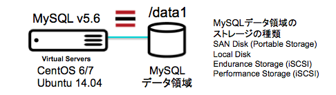
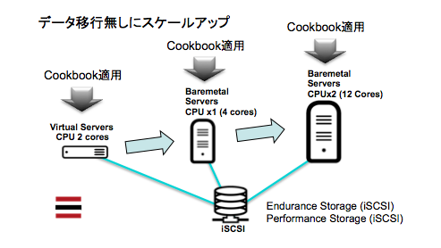

mysql01 Cookbook
================

MySQL 5.6 コミュニティ・エディションをダウンロードしてインストールするクックブックです。
このクックブックでは、LinuxディストリビューションのMySQLを利用せず、https://dev.mysql.com/downloads/mysql/ から MySQL v5.6 を入手します。そして、データ領域を "/data1" に作成します。 このため "/data1" をポータブルストレージやiSCSIストレージに設定すれば、サーバーのスケールアップが容易になります。


システム構成
------------

このクックブックは、次の図の様な構成をつくるものです。/data1のファイルシステムにMySQLのデータ領域を移動している処が特徴です。




このクックブックとiSCSIストレージのクックブックを組み合わせる事で、データ移行不要のサーバーのスケールアップが可能になります。
最初は、仮想サーバーに、iSCSIトレージと本クックブックを適用します。仮想サーバーの2CPU構成で始めたとして、そのCPU使用率がフルになってしまったら、ベアメタルサーバーに、iSCSIストレージのクックブックとMySQLのクックブックを適用します。

この際、スケールアップサーバーへ適用するクックブックで、iSCSIストレージのアトリビュート["iscsi_host"]を"standby"に、MySQLのアトリビュート["mysql"]["node"]を"standby"にします。これにより、iSCSIではセッションの確立までに留め、ストレージにファイルシステムを作成したりマウントしたりしません。また、MySQLではインストールと設定ファイルの配置だけに留め起動しません。

この様に、アトリビュートの設定を変える事で、既存環境に影響を与える事なく、スケールアップするためのサーバーを準備していく事ができます。もちろん、設定完了後に再起動するとリソースを取りにいくので注意が必要です。




前提条件(Requirements)
------------


#### 対応オペレーティングシステム
* CentOS 7.x - Minimal Install (64 bit) 
* CentOS 6.x - Minimal Install (64 bit) 
* Ubuntu Linux 14.04 LTS Trusty Tahr - Minimal Install (64 bit) 


アトリビュート(Attributes)
----------

MySQLのアプリケーションのユーザーを作成して、他のアプリサーバー等からアクセス可能な設定にします。このためのユーザー認証情報を設定する必要があります。

また、["mysql"]["node"]を"service"に設定すると、データ領域を初期化して、MySQLサーバーを起動するまで進みます。一方、["mysql"]["node"]を"standby"にすると、MySQLのインストール、設定ファイルの配置までとして、既存のインスタンスやデータに影響が無いようにします。

#### mysql01::default
<table>
  <tr>
    <th>Key</th>
    <th>Type</th>
    <th>Description</th>
    <th>Default</th>
  </tr>
  <tr>
    <td>["mysql"]["root_password"]</td>
    <td>文字列</td>
    <td>MySQL root パスワード</td>
    <td>NULL (必須)</td>
  </tr>
  <tr>
    <td>["mysql"]["db_name"]</td>
    <td>文字列</td>
    <td>データベース名</td>
    <td>NULL (必須)</td>
  </tr>
  <tr>
    <td>["mysql"]["user"]["name"]</td>
    <td>文字列</td>
    <td>アプリユーザー名</td>
    <td>NULL (必須)</td>
  </tr>
  <tr>
    <td>["mysql"]["user"]["password"]</td>
    <td>文字列</td>
    <td>アプリユーザーパスワード</td>
    <td>NULL (必須)</td>
  </tr>
  <tr>
    <td>["mysql"]["node"]</td>
    <td>文字列</td>
    <td>service/standbyの択一</td>
    <td>service</td>
  </tr>
  <tr>
    <td>["mysql"]["service"]</td>
    <td>文字列</td>
    <td>enable/disableの択一</td>
    <td>service</td>
  </tr>
</table>


使い方(Usage)
-----
必要最小限のクックブックの適用方法です。設定したいサーバーにログインして、順番に進めていきます。

```
# curl -L https://www.opscode.com/chef/install.sh | bash
# knife cookbook create dummy -o /var/chef/cookbooks
# cd /var/chef/cookbooks
# git clone https://github.com/takara9/mysql01
```
アトリビュートの設定を編集して、次のコマンドでクックブックをサーバーに適用します。

```
# chef-solo -o mysql01
```


Authors
-------------------

Authors: Maho Takara (高良 真穂)


