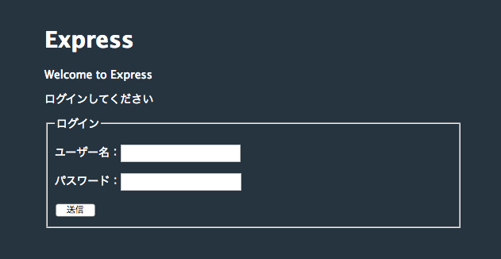
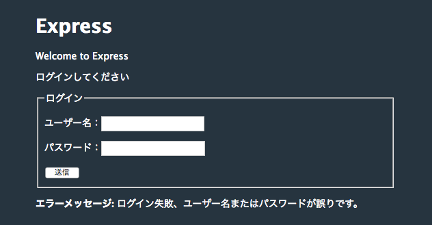

# node-express-login

Node.jsのテスト用アプリケーションを
Google Cloud Platform と IBM Cloud CloudFoundry App の両方で動かして確認したコードです。

## ローカル(MacOS)での実行

**環境**

- node バージョン: v4.4.7 以上

**インストール**

~~~
$ git clone https://github.com/takara9/node-express-login myapp
$ cd myapp
myapp$ npm install
~~~

**実行**

~~~
myapp$ npm start
~~~

**アクセス**

アドレスは、ドメイン名、または IPアドレス にポート 3000 番をアクセスする。
http://hostname:3000/

サーバーのアドレスにアクセスした時の画面

パスワードを間違えてログインに失敗して、フラッシュのエラーメッセージ表示

## Google Cloud AppEngine へのデプロイ

前提条件として、GCP にアカウントがあり、SDK がインストールしていて、gcloud コマンドが利用できる状態であるとします。

AppEngineが動作するプロジェクトを作成します。

~~~
imac:myapp maho$ gcloud projects create takara-0005 --enable-cloud-apis --name MyAppEngine5 --set-as-default
~~~

プロジェクトが作成できたことを確認します。

~~~
imac:myapp maho$ gcloud projects list
PROJECT_ID           NAME              PROJECT_NUMBER
intense-base-183010  SandBox           171831961904
takara-0005          MyAppEngine5      243253059344
~~~

AppEngine をasia-northeast1 (Tokyo) に作成する。

~~~
imac:myapp maho$ gcloud app create --region=asia-northeast1
~~~

アプリケーションをデプロイする。
もし、エラーが出たら、エラーメッセージの内容に従って、ブラウザから課金を有効にする。

~~~
imac:myapp maho$ gcloud app deploy 
~~~

ブラウザからアクセスして、動作を確認するには、次のコマンドでデフォルトのブラウザが起動して、自動的にURLをアクセスします。

~~~
imac:myapp maho$ gcloud app browse
~~~

実行状態 と URL アドレスを確認するには、次のコマンドを実行する。プロジェクト指定はオプション

~~~
imac:myapp maho$ gcloud app describe --project takara-0005
~~~

## GCP AppEngine のクリーンナップ

AppEngine の課金を止めるには、プロジェクトごと削除するようです。

~~~
imac:myapp maho$ gcloud projects delete takara-0005
Your project will be deleted.

Do you want to continue (Y/n)?  Y

Deleted [https://cloudresourcemanager.googleapis.com/v1/projects/takara-0005].

You can undo this operation for a limited period by running:
  $ gcloud projects undelete takara-0005
~~~

---

## IBM Cloud Cloud Foundry (旧Bluemix PaaS)へのデプロイ

IBM Cloud にアカウントがあり、パソコンにIBM Cloud CLI がインストールされているものとします。
ibmcloudコマンドは、bx として短縮形を利用できるので、そちらを利用します。

IBM Cloud へのログイン

~~~
imac:myapp maho$ bx login
~~~

組織とスペースを対話で設定します。

~~~
imac:myapp maho$ bx target --cf
~~~

アプリケーション名takara-myapp5 を付与して、アプリケーションをデプロイします。

~~~
imac:myapp maho$ bx cf push takara-myapp5
~~~

実行状態を確認します。

~~~
imac:myapp maho$ bx cf a
<中略>
名前            要求された状態   インスタンス   メモリー   ディスク   URL
takara-myapp5   started          1/1            1G         1G         takara-myapp5.mybluemix.net
~~~

上記のURLアドレス https://takara-myapp5.mybluemix.net/ へアクセスすることで、アプリケーションを利用できます。

## IBM Cloud CFアプリからのクリーンナップ

課金対象が外すために、削除するには、以下のコマンドを実行します。

~~~
imac:myapp maho$ bx cf d takara-myapp5
~~~

## アプリのセキュリティ アップデート

GitHubのセキュリティ・スキャンで、シビリティの高い脆弱性が発見されたので、対策を実施するには、npm update を実行します。

~~~
imac:myapp maho$ npm update
npm WARN deprecated jade@1.11.0: Jade has been renamed to pug, please install the latest version of pug instead of jade
npm WARN deprecated transformers@2.1.0: Deprecated, use jstransformer
npm WARN deprecated constantinople@3.0.2: Please update to at least constantinople 3.1.1
npm notice created a lockfile as package-lock.json. You should commit this file.
+ debug@2.2.0
+ serve-favicon@2.3.2
+ express-session@1.15.6
+ cookie-parser@1.4.4
+ jade@1.11.0
+ express-flash@0.0.2
+ stylus@0.54.5
+ body-parser@1.15.2
+ express@4.13.4
+ morgan@1.7.0
+ express-handlebars@3.0.2
added 145 packages from 168 contributors and audited 241 packages in 6.678s
found 19 vulnerabilities (11 low, 3 moderate, 5 high)
  run `npm audit fix` to fix them, or `npm audit` for details
~~~

対策を確認します。

~~~
imac:myapp maho$ npm audit fix
+ body-parser@1.18.3
+ serve-favicon@2.5.0
+ morgan@1.9.1
+ express@4.16.4
added 18 packages from 7 contributors, removed 8 packages and updated 27 packages in 3.094s
fixed 15 of 19 vulnerabilities in 241 scanned packages
  3 vulnerabilities required manual review and could not be updated
  1 package update for 1 vuln involved breaking changes
  (use `npm audit fix --force` to install breaking changes; or refer to `npm audit` for steps to fix these manually)
~~~

GCP AppEngine に再登録

~~~
imac:myapp maho$ gcloud app deploy --project takara-0005
~~~

IBM Cloud Cloud Foundry に再登録

~~~
imac:myapp maho$ bx cf p takara-myapp5
~~~

## Dockerfile と Kubernetes

Docker と Kubernetes に対応しました。

## Jenkins

Jenkins pipelineに対応しました。
