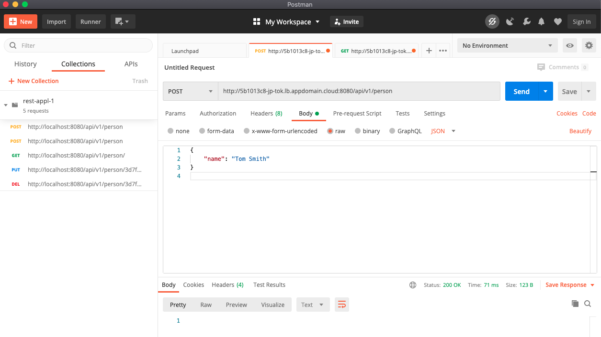

# Spring boot REST-API Application example

このアプリケーションは、コンテナ上のメモリにデータを蓄積します。したがって、ポッドのレプリカ数は１に限定して、正常に動作します。
データベースとして Postgresを使用するバージョンは、ブランチ postgres にあります。

## アプリケーションの概要

URLアドレス、または、IPアドレスを指定して、REST-APIで

~~~
$ kubectl get svc rest-java
NAME        TYPE           CLUSTER-IP      EXTERNAL-IP                       
rest-java   LoadBalancer   172.21.104.58   5b1013c8-jp-tok.lb.appdomain.cloud
~~~

API
|メソッド| URL例                                  | 機能                    | データ    |
|:------|:-----                                 |:----                    |:---      |
|GET    | http://<host>:8080/api/v1/person      | 登録済みPersonのリスト取得 | JSON     |
|GET    | http://<host>:8080/api/v1/person/{id} | IDを指定して１件だけ取得   | JSON      |
|PUT    | http://<host>:8080/api/v1/person/{id} | IDに一致するデータを更新    | なし     |
|DELETE | http://<host>:8080/api/v1/person/{id} | IDに一致するデータを削除   | なし     |
|POST   | http://<host>:8080/api/v1/person      | JSONデータを登録　　　　　　| なし    |

POSTMAN https://www.postman.com/ を使ってテストする様子

## Javaアプリのビルド方法

コンテナ上でmavenを利用してJavaアプリケーションをビルドするので、必要な環境は、Docker CEがインストールされたパソコンだけです。その他、パソコン側にJava,maven などをインストールしてビルド環境を作ることは不要です。

~~~
git clone https://github.com/takara9/webapl-5
cd webapl-5
docker build --tag <userid>/webapl5:0.1 .
~~~

## コンテナへのリポジトリ登録方法

Docker HubのユーザーID maho の部分を置換えてプッシュします。

~~~
docker login
docker push <userid>/webapl5:0.1
~~~

## Kubernetesへのデプロイ方法

デプロイ

~~~
kubectl apply -k k8s/base
~~~

削除

~~~
kubectl delete -k k8s/base
~~~

